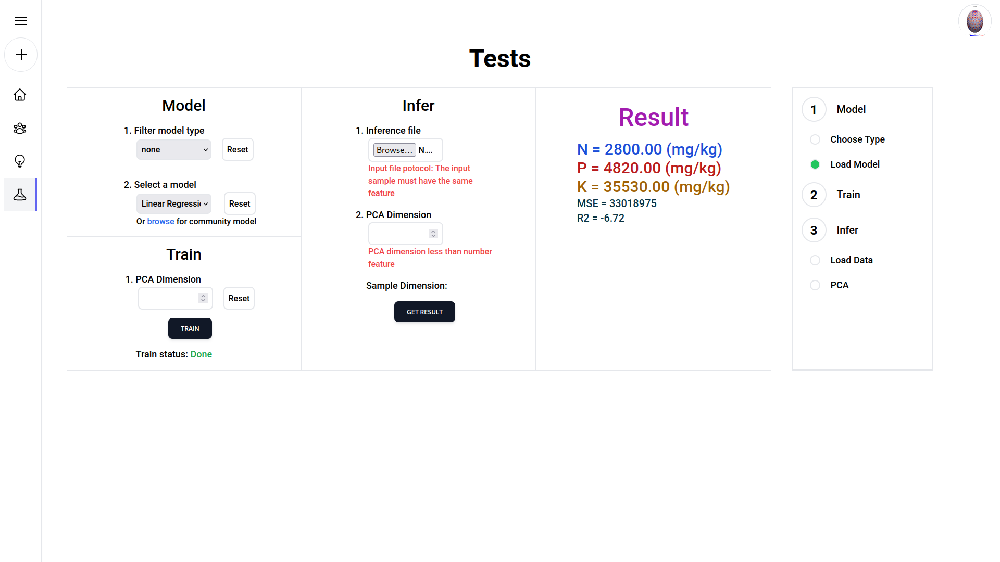
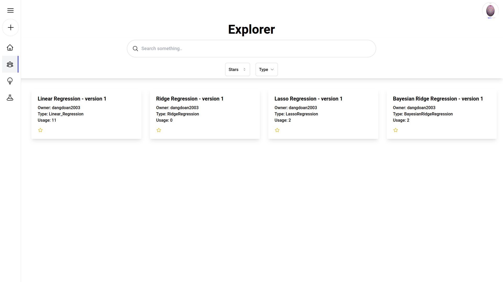
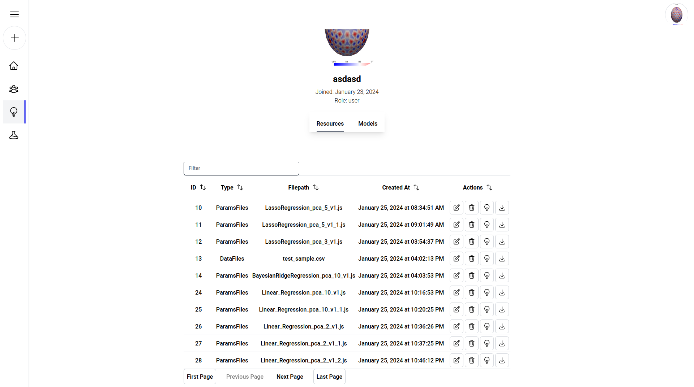
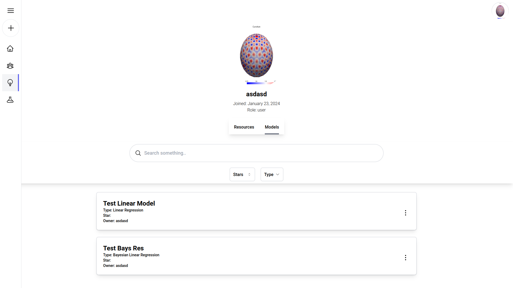
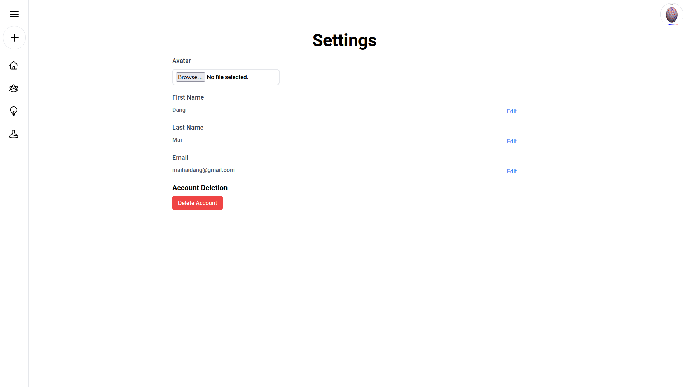
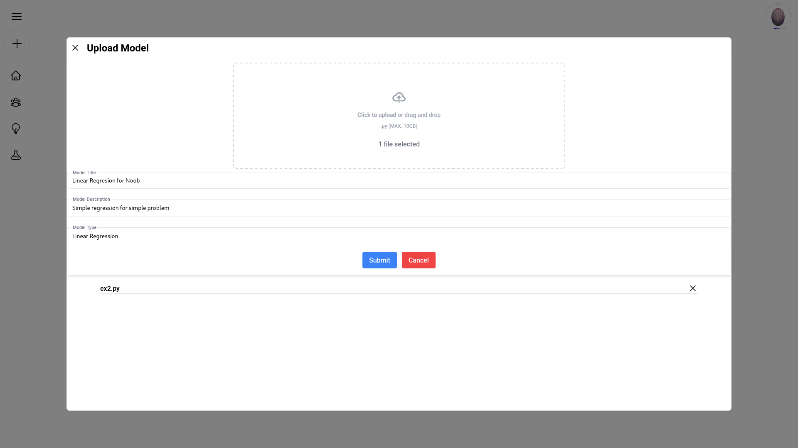
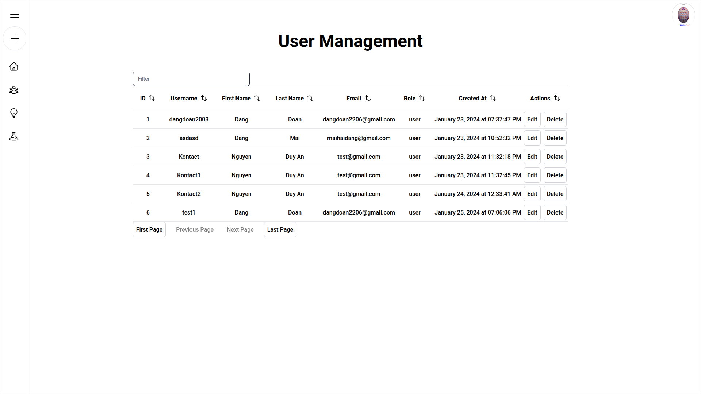
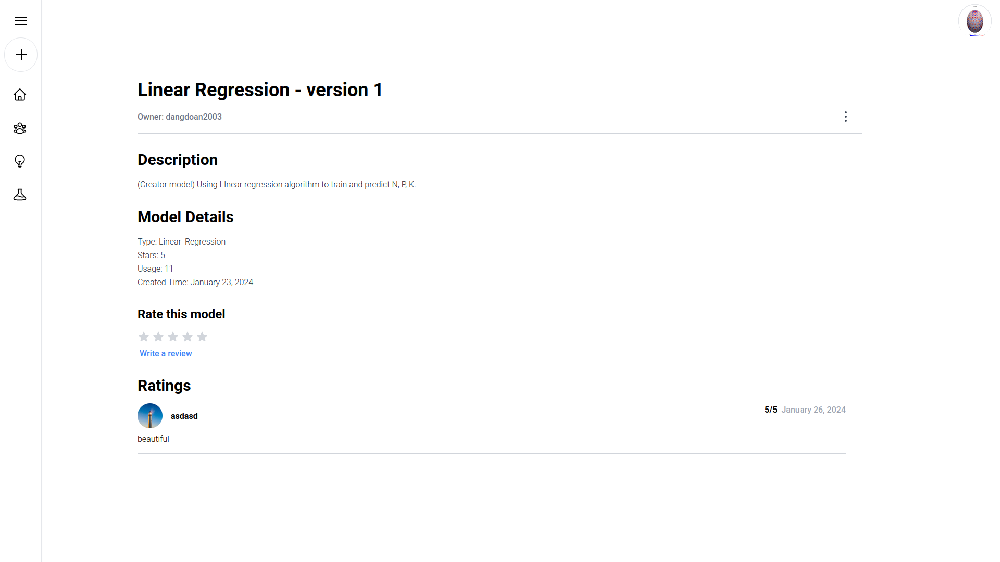

# Web Application

## Description

- This is a web application that allows users to create, read, update, and delete (CRUD) data from a database. 
- The user can also upload files such as models (.py), resources (.csv, .txt, etc) for model training and prediction, download the trained model and the prediction results.

## Frameworks and Libraries

- React + Tailwind CSS + Vite

```bash
npm install
```

- Quick Run

```bash
npm run dev
```

## Screenshots










